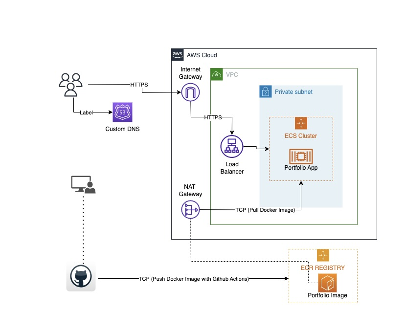

# ECS Stack

**Project Description:**

This repository contains the source code and deployment configurations for the ECS Stack- Portfolio project, which leverages AWS Elastic Container Service (ECS) for container orchestration. The deployment is managed using Terraform as Infrastructure as Code (IaC), and the CI/CD pipeline is set up with GitHub Actions.

## Table of Contents

- Project Overview
- Architecture
- Getting Started
    - Prerequisites
- Usage
- Infrastructure as Code (Terraform)
- CI/CD Pipeline (GitHub Actions)
- Contributing

## Project Overview

This project seamlessly automates the deployment of a containerized application using AWS Fargate on Amazon Elastic Container Service (ECS). The architecture is meticulously designed to facilitate a swift journey from code commit to deployment, eliminating the need for manual intervention. The AWS infrastructure is provisioned and managed with Terraform, serving as Infrastructure as Code (IaC). GitHub Actions orchestrates the pipeline, ensuring the application image is built, pushed to AWS Elastic Container Registry (ECR), and the infrastructure is deployed with Terraform, effectively running the container on ECS. This end-to-end automation streamlines the development and deployment process, enhancing efficiency and reducing manual tasks.

## Architecture



## Getting Started

### Prerequisites

Before you begin, ensure you have met the following requirements:

- AWS account with appropriate permissions
- GitHub repository for your project
- Terraform CLI installed
- AWS CLI installed and configured
- Docker for local container testing

## Usage

To run locally

```jsx
npm install
npm run dev

---

docker build -t <name:tag> .
docker run <name:tag>
```

## Infrastructure as Code (Terraform)

This project uses Terraform to manage the AWS infrastructure. The Terraform configurations can be found in the `terraform/` directory. To apply these configurations, follow these steps:

1. Change your working directory to `terraform/`.
2. Initialize Terraform:
    
    ```
    terraform init
    ```
    
3. Review and modify `terraform.tfvars/variables.tf` to match your project's requirements.
4. Apply the configurations:
    
    ```
    terraform plan
    terraform apply
    ```
    

## CI/CD Pipeline (GitHub Actions)

The CI/CD pipeline is configured in GitHub Actions to automate the build and deployment process. It includes the following stages:

- **Build**: Builds Docker containers from the source code.
- **Test**: Runs tests to ensure code quality.
- **Deploy**: Deploys the application to AWS ECS.

To set up GitHub Actions for your repository:

1. Create the necessary GitHub Secrets for AWS credentials.
2. Modify the workflow configuration in the `.github/workflows` directory to match your project's specifics.

## Contributing

Contributions are welcome! Feel free to open issues or submit pull requests to help improve this project.
